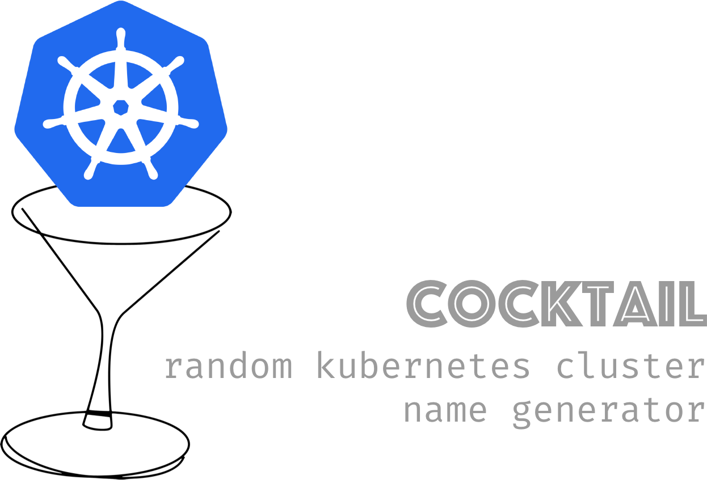

# Cocktail
 Combine two passions and this is what comes out of it.

I am a big fan of mixology. One day I decided I hated coming up with names for my [Kubernetes](https://kubernetes.io/) clusters as I test stuff, and so Cocktail was born.

# What is this?
Cocktail is a simple CLI that you can use to spit out a random cocktail name which you can use to name whatever, but I use it for Kubernetes cluster names as I have a difficult time coming up with them.


# Installing

Like any other `go` packaage.

```bash
go get github.com/sharepointoscar/cocktail
```

## Using Jenkins X CLI

I use Jenkins X on GKE and EKS (soon AKS), but here is how I quickly create my cluster passing the random name.
```bash
jx create cluster gke --skip-installation -n $(cocktail generate-name)
```
## GCloud CLI usage

If you are using the `gcloud` CLI, you can just execute the following (add whatever other flags you want)

```bash
gcloud container clusters create $(cocktail generate-name)
```

## eksctl CLI usage

```bash
eksctl create cluster --name $(cocktail generate-name)
```
